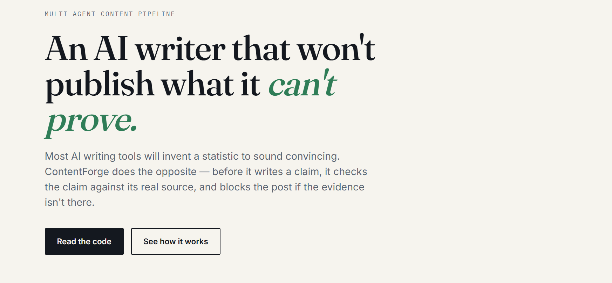
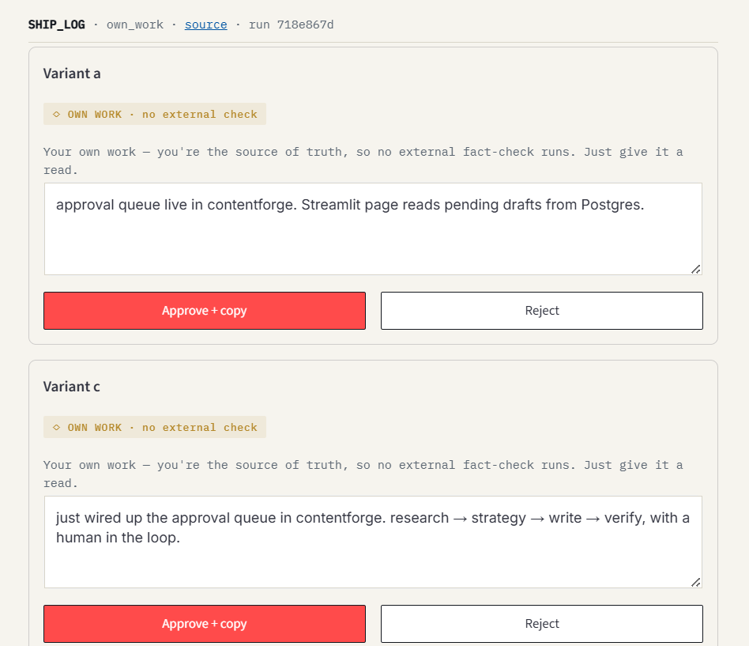
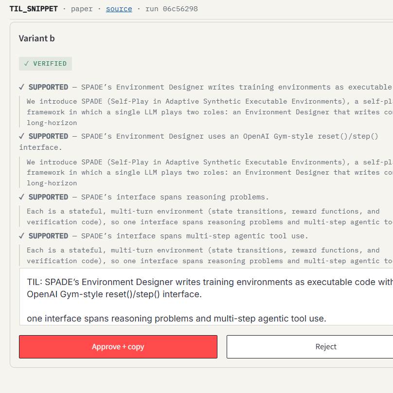
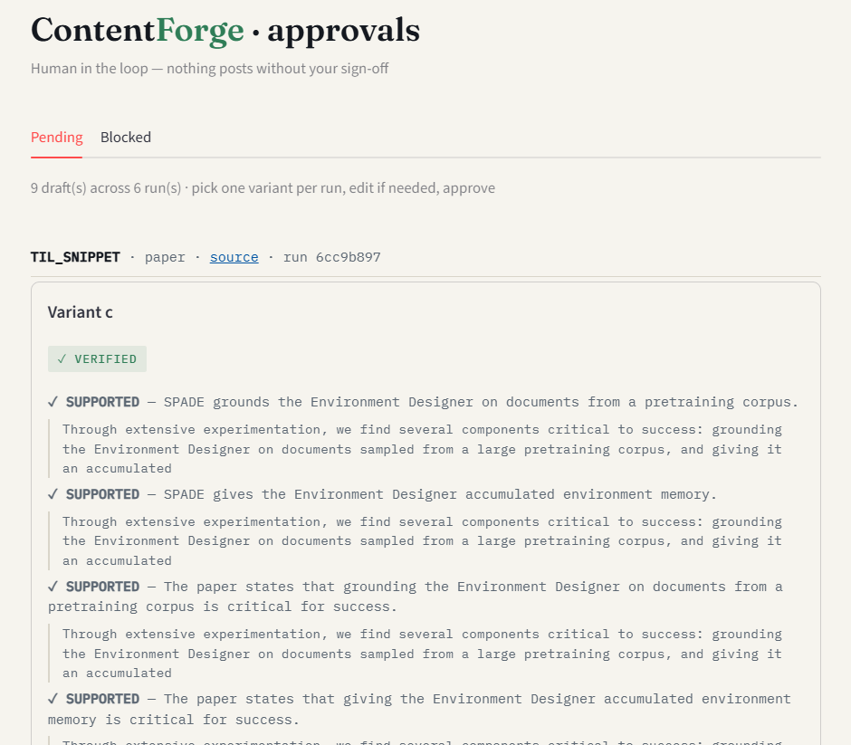

# ContentForge

**An AI writer that won't publish what it can't prove.**

A multi-agent system that turns my own development work and recent AI research into platform-ready posts — and refuses to publish a factual claim it can't verify against a real source.

🔗 **[Live landing page](https://contentforge-ecru.vercel.app/)** · **[Live API](https://contentforge-api-4blgjjggra-uc.a.run.app/docs)** · deployed on Google Cloud Run



---

## The problem it solves

Most AI writing tools will confidently invent a benchmark number, misattribute a release, or overstate a result — under your name. If you're posting to build a reputation, one fabricated fact can cost you credibility. ContentForge treats *trustworthy generation* as the actual engineering problem, not the posting.

## Two ideas, not a pile of features

**A trust layer.** Every externally factual claim is extracted, matched to evidence in its cited source, and judged. If the evidence isn't there — or the claim overstates it — the post is blocked. It fails closed: no proof, no publish. For first-party content ("I built X"), external verification is skipped — you are the source of truth for your own work.

**An interview layer.** For posts about my own work, the system reads my recent commits and then *interviews me* — what did you build, what was the non-obvious part? It writes from my answer, so it never fabricates expertise I don't have.

Nothing publishes without a human approve / edit / reject gate.

---

## How it works

```
                   +- my commits --+
first-party path:  |               +-> interview -> strategy -> write -> verify -> approval queue
                   +- my answers --+                                    (skipped
                                                                        for own work)

external path:     arxiv / news -> rank -> synthesis -> strategy -> write -> verify -> approval queue
                                   (pick    (route to a            (claim-by-claim,
                                    best of  format the             fail closed)
                                    batch)   source can fill)
```

The pipeline is an explicit **LangGraph** state machine — every node returns a status, so a failure surfaces as an error state instead of silently passing bad data downstream.

### The verifier catching a real overstatement

The whole thesis in one example. The writer turned an opinion into a design claim; the verifier blocked it before it could post:

> **BLOCKED** — "the pipeline is designed to fail loudly"
> source says only: *"i'd rather a loud failure than a clean-looking wrong answer"* — an opinion, not a design claim.

### The approval queue

Every draft lands here with its verification trail visible, so I approve *seeing why* each claim is trusted. First-party posts show as OWN WORK (no external check); external posts show each claim checked against its source.







---

## Running it

ContentForge has two kinds of entry point. **The interview path and the approval queue are run by hand — they need a human at the keyboard.** The external path is automated and also exposed over HTTP.

> **You run these yourself, locally.** The interview path asks you questions (it needs your typed answers), and the approval queue is your private review tool where you sign off on posts. Neither is deployed or automated — that's by design. Only the automated external path is exposed as an API.

**Generate a post about your own work (interactive — run this yourself):**
```bash
python run.py
```
Shows your recent commits, asks what you built and what was interesting, and generates drafts from your answer.

**Generate a post from recent AI papers (automated):**
```bash
python run_arxiv.py
```
Or hit the deployed API: `POST https://contentforge-api-4blgjjggra-uc.a.run.app/run/arxiv`

**Review and approve drafts (run this yourself):**
```bash
streamlit run approval_ui.py
```
Your private approval queue. Review each draft with its evidence, edit if needed, approve, and copy to post. **Not deployed — it's a local tool only you use.**

---

## Design principles

**LLM for judgment, code for rules.** Claim extraction, evidence judgment, synthesis, ranking, and writing use the LLM. Character limits, URL checks, and validation are deterministic code.

**Fail closed.** The verifier blocks on missing or insufficient evidence rather than passing a clean-looking wrong answer.

**Provenance is mandatory.** A finding carries its source URL from the moment it enters the system; a claim without its source is a bug.

**One LLM gateway.** Every model call goes through a single client reading one config value — when the model was deprecated mid-project, the fix was one line.

---

## Stack

Python · LangGraph (multi-agent orchestration) · FastAPI · PostgreSQL (Neon) · Redis (Upstash, seen-cache) · Docker · Google Cloud Run · Groq/Qwen · Streamlit · Tavily · arXiv · PyGithub

Deployed as a containerized service on Cloud Run, with cloud caching and persistence — not a localhost demo.

---

## Project structure

```
contentforge/
├── run.py                 # interactive first-party path (run yourself)
├── run_arxiv.py           # automated external path
├── api.py                 # FastAPI — automated paths over HTTP
├── approval_ui.py         # Streamlit approval queue (run yourself)
├── graph.py               # LangGraph state machine
├── core/                  # config, llm gateway, models, state
├── sources/               # github_sources, interview, web, arxiv_source
├── writers/               # formats.md, voice.md, strategy, x_writer
├── agents/                # verifier, synthesis, ranker
├── services/              # validators, cache (redis seen-cache)
└── storage/               # schema.sql, db (drafts / verifications / posts)
```

---

## Status

**Built:** first-party path (commits + interview), external path (arxiv/news → rank → synthesis → write → verify), claim-level verification with stored evidence, seen-cache, Postgres persistence, human approval UI, FastAPI, deployed on Cloud Run.

**Planned:** scheduled runs, richer paper ingestion (method sections, not just abstracts), verifier precision/recall benchmarking.

---

*Built by Prashant Kumar as a study in trustworthy generation — the same evaluation discipline I applied to a production RAG system, aimed at a different question: not "is the answer grounded?" but "can this claim be published under my name?"*